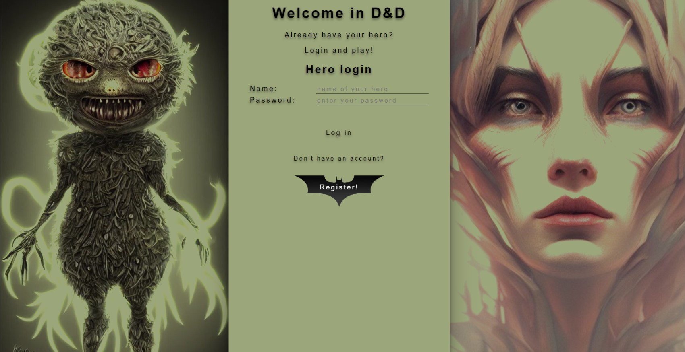

# Final Study project - Dungeons & Dragons

Date: 2022/08-2022/11

* 3 of 3 Study project - Project phase - real team coding
* Dungeons & Dragons
* Online RPG game

Technologies:

* Backend: Django (Python)
* Frontend: VueJS
* DB: PostgreSQL
* RabbitMQ

Used Tools:
* SCRUM metodology
* JIRA
* GitHub
* PyCharm
* CircleCI for code autotesting
* Heroku for autodeployment from GitHub

Login page:

Profile page:

Journal page:

Game map page:

Fight page:

